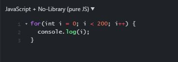
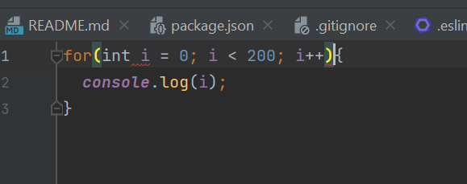

# The Appeal of a Beautiful User Interface

In the same way that fashion styles, advertisements, and special effects are constantly changing and adapting with the times, so too are the user interfaces seen on websites across the internet. Websites in the early days of the internet are easily recognizable through their lack of a “pretty-looking” user interface, generally cluttered with vertical lists of hyperlinks and dimensionless buttons or menus.
  
Nowadays, however, websites are filled with eye-catching color schemes, buttons, menus, and images that all add to the user’s experience of the website and may even influence the user to participate in certain activities on said website. For instance, we are able to compare the extremely bland looking website above to the current Apple website. Apple products are generally praised for their simplicity and this is clearly reflected in the way that their home page is formatted.

User interfaces are thus a major aspect of website design and are basically the entire reason that when you learn HTML, you also learn the style sheet language CSS. However, after developing multiple websites, it may become tedious to continuously create new classes and ids for aspects of a website that are generally found all over the internet, and that is where UI frameworks come into play. UI frameworks are modern stylesheets that contain classes that can be used in the creation of a multitude of websites. The frameworks help to give the programmer an easier way to style their website in a way that appeals to the target audience of said website.
  

# Different Website, Same Components

# Less Work, Better Looking Website

Either at the middle of ICS 111 or the very beginning of ICS 211, we were instructed to install a Java code analysis tool called *“checkstyle”*. This was my first introduction to a *“coding standard”* and honestly, at the start, I was not a big fan. I had somewhat developed my own unique *“coding style”* and I didn’t like the idea that all of my tab-key indents would need to be replaced by double spaces. I thought it was ridiculous, but in reality, it was conditioning me towards a style that was easily understandable by everyone rather than just myself.

A feature that I found especially helpful with checkstyle was an error counter that was implemented to the top of the IDE. The counter would list out the total amount of problems that the coding style had with the code that you would be writing and it would be replaced by a green checkmark once all of the errors were fixed. This feature would lead me to realize that these coding standards could really be treated as an extremely specific rubric that told me exactly if I had done the assignment correctly or not. Eventually, fixing the errors in checkstyle became one of my favorite parts of coding itself (especially if my code worked on the first try).

This all brings us to the coding standard that we will use for ICS 314, which utilizes a code analysis tool called *“ESLint”*. Starting off with the browser-based IDE JSFiddle, I was often irritated that at times I would not be able to identify extremely simple errors in my code that could have been caught with a code analysis tool like checkstyle. 

For example, there is no indication that the following for loop using java syntax is incorrect in JSFiddle: 

Using IntelliJ with ESLint on the other hand will yield the following error:

Thus, it was a relief to see that we were going to use a code analysis tool like checkstyle for this class. Over time, checkstyle has allowed me to see that even though formatted and unformatted code perform the same tasks, formatting code allows for a better understanding of everyone looking at said code. In fact, when learning Javascript itself, I found it extremely useful that the website freecodecamp.org utilized its own coding standard. All in all, I believe that exposing ourselves to and learning from these coding standards and code analysis tools will help to make us all more efficient programmers.
