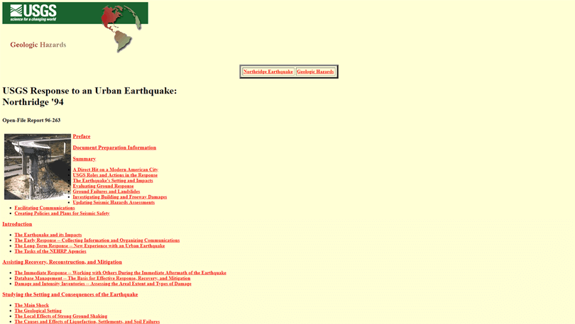
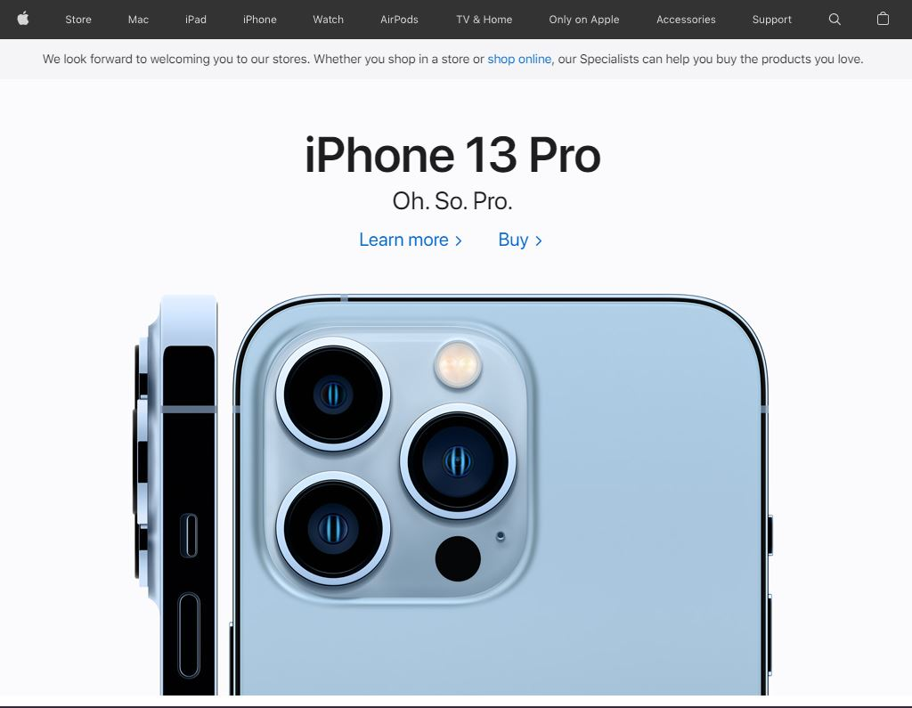
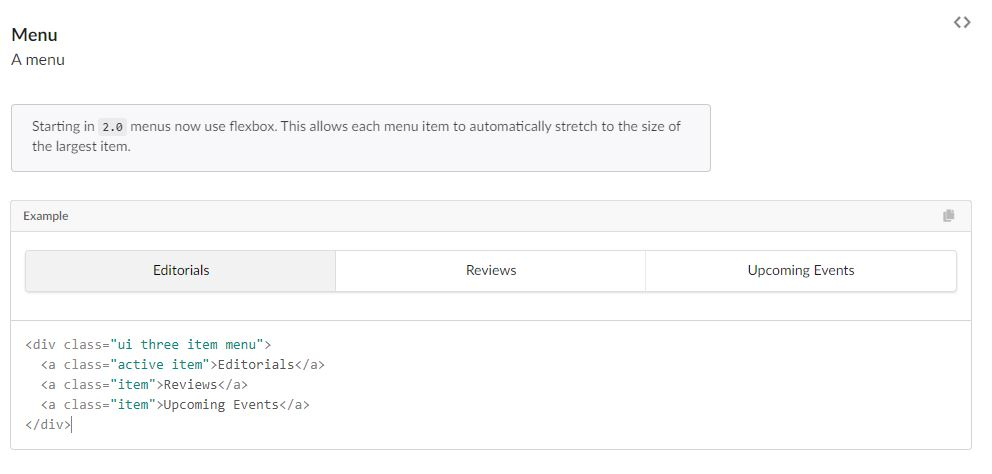
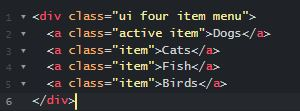

# The Appeal of a Beautiful User Interface

In the same way that fashion styles, advertisements, and special effects are constantly changing and adapting with the times, so too are the user interfaces seen on websites across the internet. Websites in the early days of the internet are easily recognizable through their lack of a “pretty-looking” user interface, generally cluttered with vertical lists of hyperlinks and dimensionless buttons or menus.

 
Nowadays, however, websites are filled with eye-catching color schemes, buttons, menus, and images that all add to the user’s experience of the website and may even influence the user to participate in certain activities on said website. For instance, we can compare the extremely bland-looking website above to the current Apple website, which uses a UI framework. Apple products are generally praised for their simplicity and this is clearly reflected in the way that their home page is formatted.

User interfaces are thus a major aspect of website design and are basically the entire reason that when you learn HTML, you also learn the style sheet language CSS. However, after developing multiple websites, it may become tedious to continuously create new classes and ids for aspects of a website that are generally found all over the internet, and that is where UI frameworks come into play. UI frameworks are modern stylesheets that contain classes that can be used in the creation of a multitude of websites. The frameworks help to give the programmer an easier way to style their website in a way that appeals to the target audience of said website.
  

# Different Website, Same Components

A key strength of using a UI framework is that the style classes of varying website components are already written out for you and you just need to learn how to implement the classes on your own. This is similar to learning different built-in methods in a programming language, as many times you won’t have to understand how the method works, but only what the method is doing. UI frameworks can have pre-written website components, as generally speaking, websites across the internet tend to share components that help users navigate the website. For example, many websites tend to have a top menu bar that contains general terms that allow the user to easily navigate through the website. Websites can also have buttons, text-input sections, search bars, comment sections, and many other features. The main takeaway is that many websites share a basic foundation; stripping many websites of their UI would make them all look the same.

# Less Work, Better Looking Website

UI frameworks are extremely helpful when it comes to actually going through the coding process of the website itself. As stated previously, the implementation of the framework is very similar to calling a method in a coding language. Thus, it shouldn’t come as a surprise that documentation exists for every class that a UI framework offers. Essentially, if you want to do something with the website that you are creating, the process comes down to looking up the component you are trying to create, understanding the syntax of the class you will be applying, and then simply applying the class into the HTML of the website. This entire process skips right through the coding of the class and allows the programmer to code more efficiently while increasing the website’s quality.

We can look to the UI framework “Semantic UI” as an example of this simplicity. Suppose that we would like to implement a simple menu into our website. The menu would consist of four different items: Dogs, Cats, Fish, Birds. Our first step in the UI frameworks process would be to look within the documentation for a “menu-like” component, which luckily Semantic UI has:

The documentation gives us easy access to the syntax, from which we can see that there is an outer division with class “ui three item menu”, with three inner links with classes “active” and “item”. We are able to modify this code to fit our needs by changing the “three” class to “four”, adding an extra link item, and changing the different text associated with the different links:

I believe that although it may seem like learning an entirely different programming language, learning a specific UI framework is worth it. After working with the framework for a while some terms and patterns in syntax will become second nature and website building will become extremely simple rather than if you weren’t to have used a UI framework. They also help drastically in reducing the time spent coding as you don’t need to familiarize yourself with how to create every new component on a website, rather you simply need to skim through documentation. Personally, I love the idea and implementation of UI frameworks, and I definitely will be using them at some point in the future.
