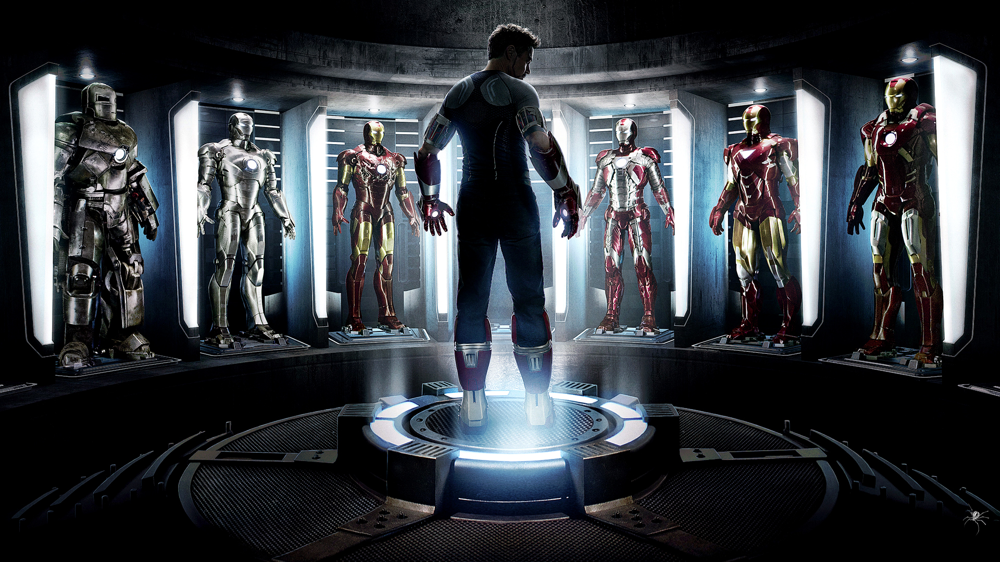

<h1> Dreaming Before Doing </h1>
From the time in which I was a very young child, I was always interested in the different intricacies of everyday objects and appliances around me. 
I liked building things and taking them apart, so I was a big fan of the game Minecraft and my heart would race at the thought of building large lego sets. 
I am a big fan of the Marvel Cinematic Universe and idolized the avenger Iron Man, making a goal for myself to one day build a suit just like his from the screen or have my own version of his AI “Jarvis”. 
These were crazy dreams that I had in 2010. Dreams that can now become a reality.
 

   
Today, the possibilities of creation in the digital world are basically limitless. In the past two centuries, we as a society have overcome many obstacles and created
hardware and software that seemed previously impossible. My personal AI that I had once fantasized in the 5th grade was something that I could look up today with a simple
tutorial on youtube. It is this endless stream of technological advancements and possibilities that led me to taking an interest in the major of computer science as a whole.
 
   
<h1> A Slow Start </h1>
Though I was always interested in where websites came from or how different software and applications were created, I never really looked into the details of software engineering 
until my freshman year of college. And even then, my peek into the world of software engineering was extremely shallow. I still have no clue exactly how a web domain is claimed or
created and I have no idea how to create an application. I believe that these are basic concepts that we will go over in this course, and as such they are two things that I would like 
to learn this semester.

 

   
After gaining a thorough understanding of how software engineering works, I would like to utilize what I have learned in this course into actual real world applications. Though I believe that ICS 111
, 211, and 311 were a great way to start off the computer science degree path, after taking those classes I only knew the basics of Java and separate algorithms. We weren’t provided with the tools 
to create our own gimmicks and creations, and I feel as if 314 serves that purpose well. I am excited to finally utilize different coding languages towards things other than a simple laulima assignment.
 
   
<h1>The 314 Endgame</h1>
All of that being said, I would like to return to my roots when discussing the things that I would like to develop in the future. Freshman year of college was my first year of experience in the computer science
field and I feel as if I have learned a lot from it. Though I will gain many skills and experiences in this course, the main thing that I want to learn is whether or not I become genuinely interested in software
engineering after giving it a hands-on approach. If I do become invested, I would love to develop different web, mobile, and desktop applications. If I am not too invested in the course however, I would love to 
still gain the knowledge to bring my own Jarvis AI to life. Either way, I believe that this course will be game-changing in my computer science career path.
 
   

