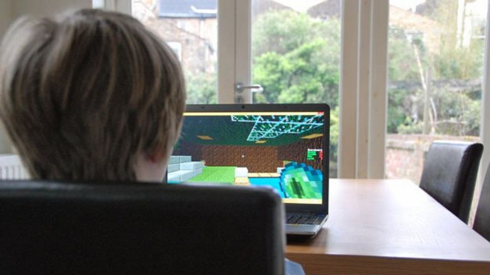
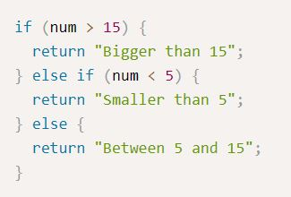
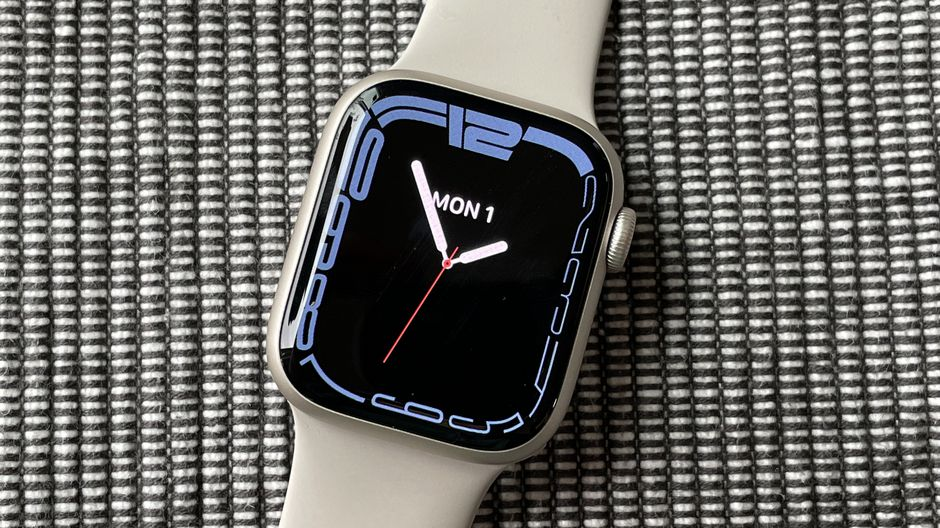

<h1> Unfamiliarity </h1>
The computer science track at the University of Hawaii at Manoa has always been a shaky one as I really had no previous experience with computer science in the past. Growing up I had no problem sitting behind a computer for entire days at a time talking to friends, surfing the internet, and playing video games, but at no point did I ever look into programming or learning a programming language. So immediately after declaring my major as computer science in freshman year, I found it a little difficult to learn and adapt to the terminology of the Java programming language and all of its little intricacies.
 

   
Fast forward to the present day, ICS 111 and 211 allowed me to dive into and familiarize myself with Java and the IDE Eclipse, while 311 helped to introduce a multitude of algorithms and datastructures that I would use in programming. I finally felt like I was at some sort of breathing point where I could stop and be comfortable with where I was for a bit, but I also yearned to go above and beyond and learn new things. I wanted to go back to being uncomfortable, being unfamiliar; the only problem was I didn’t know where to start.
 
   
<h1> Code Switching (Literally) </h1>

ICS 314 started immediately on a new foot with the pregame module, which listed three new languages and a new developer environment. Of the three languages, the one I wanted to start right away was JavaScript. Prior youtube videos and conversations with friends made it clear to me that Java and JavaScript were two separate languages, but naturally I thought to myself <em>“surely if Java is in the name, it won’t be all that different” </em> . And with that, my journey into JavaScript had begun.
 

   
The FreeCodeCamp course that we were assigned in E06 first consisted of 113 “Basic JavaScript” problems that were designed to give students a general rundown of different elements in JavaScript and how to use them. It was essentially ICS 111’s topics focussed into JavaScript rather than Java, which was interesting as they shared many elements with each other, including the syntax for the if else statements and loops.
 
   
However, there were also parts of the course that I found particularly interesting as they were completely new from the Java language. The majority of these changes were seen in the ES6 section of the course, which detailed newer features of the language that were released in 2015. A feature that I was especially interested in was the Promise function, which I felt added variety over simple if else statements. Though I don’t have a lot of experience, due to JavaScripts features mentioned in the ES6 section, I believe that JavaScript is a good language for software engineering.
 
   
<h1> Speed++ </h1>
Another aspect of ICS 311 that proved to remove me from my comfort zone was the introduction of “athletic software engineering”. Athletic software engineering is a method of testing our knowledge of the concepts covered by adding the variable of time to our coding problems. We are asked to complete the questions under a certain amount of time, generally with 4 different time challenges, practicing them over and over again until we have met the time threshold. 
 
   

Personally, after doing these two practice WODS, I enjoyed timing myself and always improving on the time after figuring out the problem for the first time. I feel as if it not only improves our ability to type out the problems, but it also helps us to memorize the syntax of the problems that we need to solve. The technique reminds me of video game speedrunning, in which people try to beat video games in record time, generally perfecting their speed on minor parts of the game in the process. All in all, I feel as if these WODS that utilize athletic software engineering will be challenging but extremely beneficial.

 

   
   
