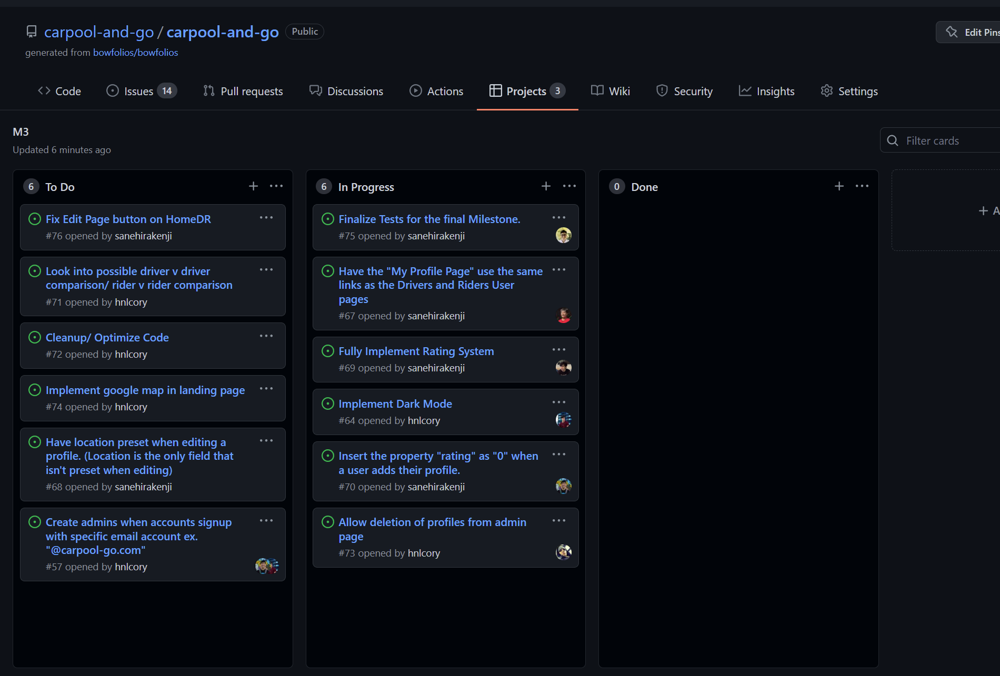

# Determined Roots

At the beginning of this semester, we were all asked the question “What are you most excited to learn in this course?”. Though others had questions like “I want to build a website” or “I want to learn new programming languages”, my answer to the question was “I want to learn how to apply the knowledge gained from previous courses into a working application”. This is because in all of the previous Computer Science courses, we have learned how to develop code and run code in consoles or small windows, but we had never actually developed an application that was easily accessible to others. From the start, I knew exactly what I was going for, and the course itself delivered by teaching us to use the code we write to impact or even create web applications.

Going into the course itself, I had little to no knowledge of what software engineering was; I mainly associated the term with web application development. I was (and still am) relatively new to the field and though I was set on a computer science degree, I had no clue what field of computer science I wanted to pursue. Software Engineering thus gave me an opportunity to see first-hand a potential career path that I could follow, and in doing so I have learned certain concepts that define the field of “Software Engineering” beyond just “developing Web Applications”. These concepts were easy to understand yet complex in application and it was entertaining to apply each of them into practice right after learning about them in the experiences and WODS.

Design patterns within computer science are the general skeleton for solutions that have been developed for common problems or tasks. These skeletons simply give the user a vague idea of how to solve the problem, but not exactly how the user is able to implement this solution; the idea of shaping the bowl out of clay doesn’t tell the user how to shape the bowl out of clay. In that sense, the design pattern itself simply gets the user closer to the solution they are looking to obtain, whilst allowing the user to map out their own unique solution to their problem. When developing this solution, users are also not limited to a single design pattern, rather they are able to use them simultaneously, given they all work towards the same resolution. This idea is very important to software engineering, as generally, computer software development consists of a combination of problems that the software is aiming to solve.

# No Loops?

One of the concepts that I really enjoyed learning about in this course was Functional Programming. Functional Programming is a concept that deals with the idea that the code in question is developed through different functions that can compute different calculations without changing the original data. Functional Programming is not a new topic to myself and many other computer science students, as it was utilized heavily in ICS 111, 211, and 212. However, this course introduced some new Javascript-specific concepts that the previous courses had not covered, which included using functions as values, arguments to other functions, and as return values to functions. 

A mind-blowing aspect of functional programming was seen through the introduction of underscore.js. Underscore.js is a Javascript library that allows users to condense multiple lines of complex code of a common operation into a single line of code. These common operations can include but are not limited to: finding the max or min in a list of objects, sorting a list of objects by a specific parameter, returning a single value from a group of objects, finding an object in a group of objects, etc. The best part about these underscore functions, however, is the idea that they essentially replace loops in the code we write. For example, suppose that you have a for loop that goes through a list and sums all of the elements. This for loop would likely need to be spread out over a couple of lines to be easily understood, while using underscore the loop could be condensed into a single line of comprehensible code.

# Piecing Things Together

Another of the concepts that I enjoyed learning about this semester was Agile Project Management within a computer science project team. Agile Project Management essentially described a development process that was timely and efficient in nature, allowing a project to be completed in small chunks of time and work with people understanding what to do at all times. This was a very interesting concept for me to learn personally as, due to COVID-19, this course would be my first experience in working with a group of people on a coding project. It was definitely a rocky ride working with and relying on a group of people to finish their individual jobs, but all in all the Agile Project Management process has proven to be very beneficial.

One of my favorite parts about Agile Project Management was the introduction and utilization of Issue-Driven Project Management, which essentially had us break the big final project into much smaller and more manageable issues. This really helped to not overwhelm any group members with work, as everyone would essentially build different parts of the project individually to be more efficient in the application-building process. Within our final project specifically, we used an automated kanban project board within github to manage these issues. Personally, I found this board to be extremely helpful throughout the development of the final project and I especially enjoyed the satisfaction of closing issues and seeing the amount of “to-do” issues shrink.

# What Now?

All in all I believe that ICS 314 has been one of my favorite ICS courses so far. Completing WODs in a timely manner tested my ability to code quickly, and although it was difficult at first, I found it very fun towards the end of the semester. The course also reassured my major choice as I have found a potential career path that I am genuinely interested in, which I can also find myself having fun in. In fact, if I don’t find anything that interests me more than Software Engineering, I believe that this may very well be the career that I’d like to see myself in. The concepts discussed in this course and in this essay are also ones that will benefit me in the long run of my computer science career as a whole as well as any other project I end up putting myself into.
