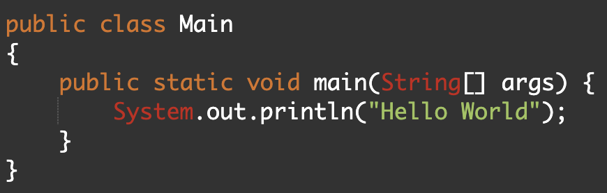

# Training Wheels

	A problem that I have always encountered when it came to many different school assignments in elementary through high school was the fact that many times the way that an assignment had to be structured was not clearly stated in the instructions. I’ve always been a by-the-book student and often stressed over whether the way that I structured an assignment was exactly what my teacher was looking for. Though other classmates of mine dreaded lengthy rubrics filled with guidelines, I was extremely fond of them as they essentially left no room for errors or misinterpretation of the instructions. There was a clear cut answer between whether or not an assignment looked right or wrong and personally, I liked it.

 
# If It Works, It Works.

	Though I enjoyed being by-the-book with essays and projects in high school, I started loosening up a bit in college, especially with computer science classes and the assignments that came with them. At the beginning of ICS 111, I was completely new to the subject and initially had a pretty rough time learning to code and all of the syntax that came with it. Due to this layer of difficulty that came with learning the Java language, I often resorted to the mindset of “if it works, it works”, and I didn’t care much for runtime, storage usage, and most importantly to this essay, the structure of my code.

	More often than not, code that I would turn in for ICS 111 looked like a well-typed-out essay, rather than a computer science coding project. I was under the initial impression that there was a certain amount of freedom that came with coding, such that as long as you typed out the correct syntax and the code does what it is supposed to do, we had done the code correctly. On top of this, I was already getting full credit on assignments without a coding structure, so why should I even bother adding one?  Being almost 2 years down the computer science path, I would definitely not give my past self full credit for the “lazy” looking un-formatted code.

# The Game Changer

	Either at the middle of ICS 111 or at the very beginning of ICS 211, we were instructed to install a Java code analysis tool called “checkstyle”. This was my first introduction to a “coding standard” and honestly at the start I was not a big fan. I had somewhat developed my own unique “coding style” and I didn’t like the idea that all of my tab-key indents would need to be replaced by double spaces. I thought it was ridiculous, but in reality it was conditioning me towards a style that was easily understandable by everyone rather than just myself.

	A feature that I found especially helpful with checkstyle was an error counter that was implemented to the top of the IDE. The counter would list out the total amount of problems that the coding style had with the code that you would be writing and it would be replaced by a green checkmark once all of the errors were fixed. This feature would lead me to realize that these coding standards could really be treated as an extremely specific rubric that told me exactly if I had done the assignment correctly or not. Eventually, fixing the errors in checkstyle became one of my favorite parts of coding itself (especially if my code worked on the first try).

