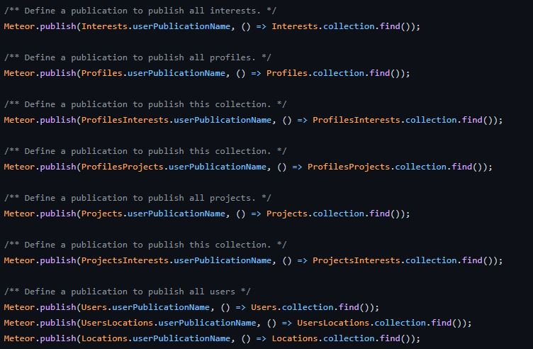

# The Bowl Solution

Suppose that someone had tasked you to “make a bowl”. That’s it. No other instructions on how to create said bowl nor any specific materials on what to make the bowl out of. All you know is you’d have to create a bowl. The first thing you would likely do is think of what exactly a bowl is. The definition of a bowl from the Oxford Dictionary is “a round deep dish or basin used for food or liquid”. From this, you would most likely start thinking about methods of creating the bowl. Perhaps you could hand carve it out of a chunk of wood. You could pick up pottery and form the bowl out of clay. You could even find a 3D model of the bowl online and 3D print a bowl out of plastic! The point is, when presented with a general problem such as making a bowl, there are two steps in the creation process: understanding the end goal and deciding on an efficient solution. Computer Science Design Patterns serve as the foundation of these efficient solutions that lead to specific end goals.

Design patterns within computer science are the general skeleton for solutions that have been developed for common problems or tasks. These skeletons simply give the user a vague idea of how to solve the problem, but not exactly how the user is able to implement this solution; the idea of shaping the bowl out of clay doesn’t tell the user how to shape the bowl out of clay. In that sense, the design pattern itself simply gets the user closer to the solution they are looking to obtain, whilst allowing the user to map out their own unique solution to their problem. When developing this solution, users are also not limited to a single design pattern, rather they are able to use them simultaneously, given they all work towards the same resolution. This idea is very important to software engineering, as generally, computer software development consists of a combination of problems that the software is aiming to solve.

# My History of "Making Bowls"

Throughout my computer science career, there have been many instances where I have found myself using a design pattern without even knowing it. For example, I believe that in ICS 111 we had used the design pattern “Factory” many times when learning about the process of coding. A factory can act similarly to a fork in the road, providing the user with many options to pick from and paths to each of them depending on the needs of the user themselves. Of course, at the time I had no clue that this was a “design pattern” or even what a “design pattern” was, but that just goes to show how widespread these solution structures are.

However, after learning a decent amount about design patterns, I have realized that we have started to utilize a lot more of them within the ICS 314 course as well as our ICS 314 final project. Within the project, we utilize a multitude of design patterns, which include Prototype, Observer, MVC, Front Controller, Singleton, and Factory. One of the design patterns that I really enjoyed learning about was the Observer’s Publish/Subscribe style design pattern as it allows different pieces of a website to be shared to other places on the same website. It is something that I don’t believe we went over in any of my previous ICS courses, and it is just another example of how design patterns can be universally applied and will be very useful down the line.
