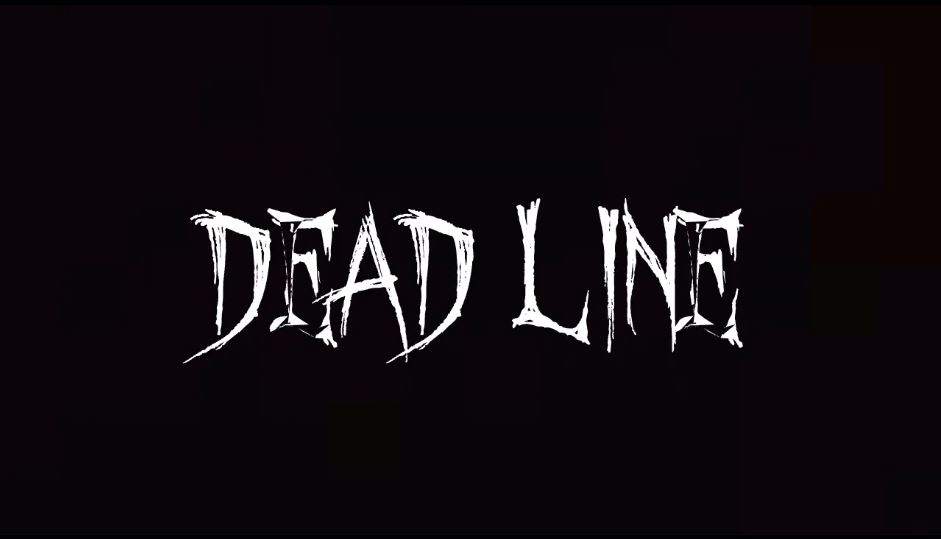
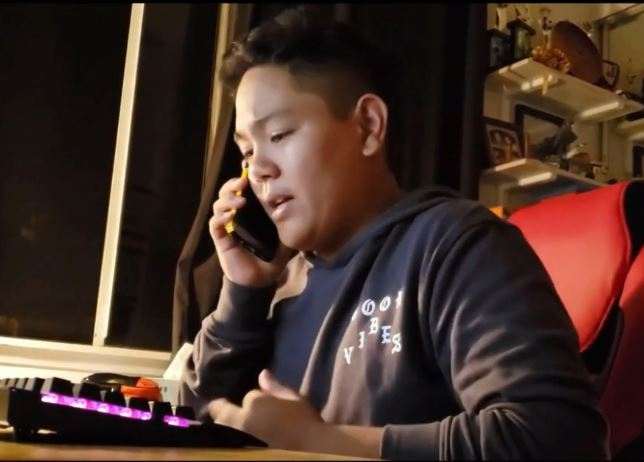
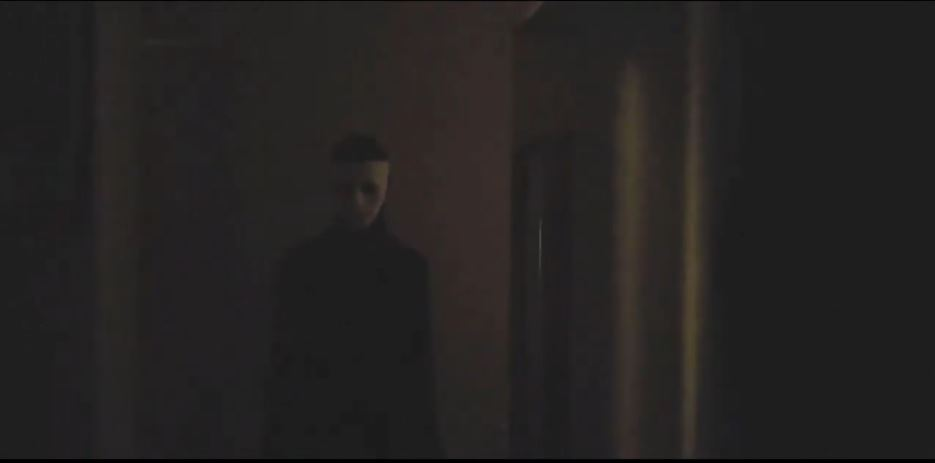

<em>Dead Line</em> was a short film project that I was able to create for a high school class. I worked on this project with my friends Shueng, McGwire, Bryson, and Kara for the film competition [Ten Scary Minutes](https://contest.tenscaryminutes.com/). 

The project guidelines entailed that the video needed to be horror-themed, under 10 minutes, and needed to be filmed on a phone rather than on a camera. I was able to write, edit, do the camerawork, and submit the project on the website. The project was filmed at my house with a Samsung Galaxy S7. It was edited on the free video editing software <em>HitFilm Express</em>.

The premise follows a teenager who finds out that he has more than just homework to worry about when he sees a mysterious masked man dancing in his backyard. While calling 911, the line goes dead and the masked man makes his way into the house, eventually outsmarting the boy and cornering him. The premise was loosely based on a short film that I had seen previously in the year titled ["The Smiling Man"](https://www.youtube.com/watch?v=_u6Tt3PqIfQ).

Source: <a href="https://contest.tenscaryminutes.com/title/5f50888d529e9de1448cf6e0">Click here to view the horror video project</a>
