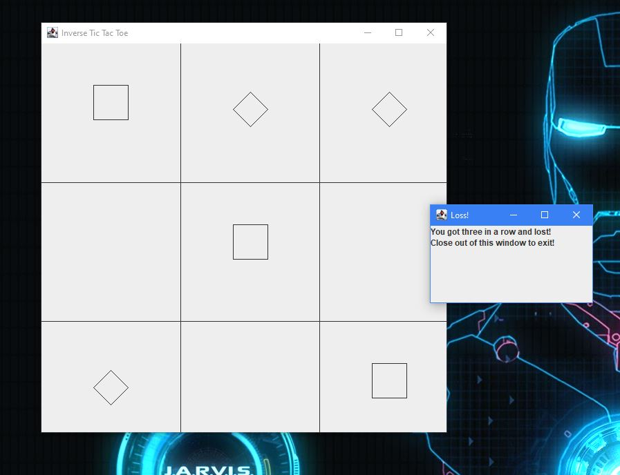
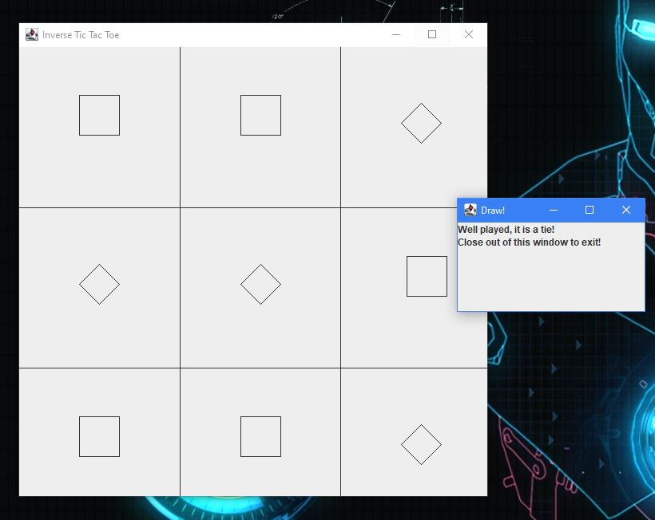
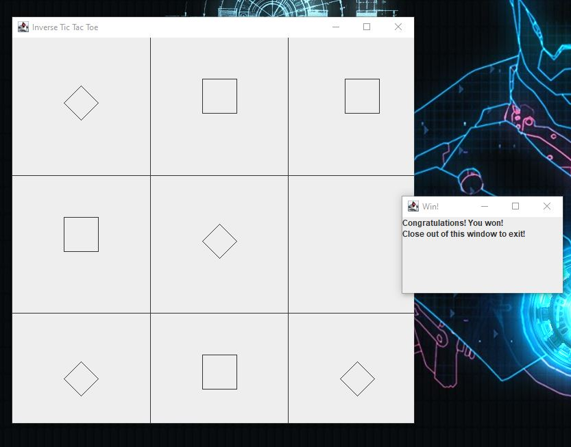

<h5> Languages:</h5>
  <ul>
  <li>Java</li>
  </ul>
  
  The basic premise of this project was to create a version of tic tac toe in which the player and opponent are trying <em>not</em> to get 3 Xs and Os in a row.
   
   
  More specifically, the prompt required us to create a game of tic tac toe that utilized the skills that we had learned throughout the course of ICS 111. This included creating a JPanel that would display the gameboard of tic tac toe, utilizing switch, if-else, loops, and booleans to ensure the game ran smoothly, and finally creating different methods that would create the foundation of the entire game itself. This was the first project that we had creative liberties over in the class, such that it was one of three different prompts that we could choose from, and we received little to no guidance on how to do it.
   
   
  Though we had the option to work with others on this final project, due to the online-based nature of COVID-19 I was unable to find a partner to work with and I handled it alone. Not only did this problem introduce me to the idea of reusing code through methods and using a JFrame with actual graphics, but I was able to condition my knowledge on little technical aspects of computer science like variables, arrays, if/else statements, switch statements, and loops. All in all, I think that this was a great exercise that reflected and refined my knowledge on Java.
   
   
  Below are examples of the outputs of this game, as well as a link to the Github repository:
   
   
  <h3>Game Loss:</h3>

 
   
<h3>Game Tie:</h3>

 
   
<h3>Game Win:</h3>

 
   
Source: <a href="https://github.com/sanehirakenji/Java-Inverse-Tic-Tac-Toe"><i class="large github icon "></i>Click here to view the Github Repository for Inverse Tic Tac Toe</a>

